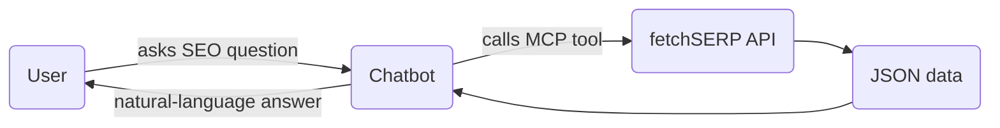

Every day developers use fetchSERP to build products that need fresh SEO & web-intelligence data. Here are some battle-tested patterns to spark ideas.

## 1. SEO Chatbots

Give your conversational app real-time access to SERP data, keyword metrics, backlink info, and more.

**Endpoints used**: `serp`, `ranking`, `keywords_search_volume`, `backlinks`

---

## 2. Competitive Rank-Tracking Dashboard

Monitor how you and your competitors rank for thousands of keywords across multiple search engines.

* Schedule a daily cron job
* Fetch `ranking` endpoint for each (keyword, domain)
* Store history in a timeseries DB (e.g. ClickHouse)
* Visualize trends with Grafana or a custom React app

---

## 3. Content Gap Analyzer

1. Call `serp_html` for the top 20 results of a target keyword.  
2. Extract headings & semantic structure with a parser (e.g. Cheerio).  
3. Feed the content into an LLM to summarise missing angles.  
4. Output recommendations in a Notion doc.

---

## 4. Backlink Outreach Automation

* Use `backlinks` to pull fresh link lists for a competitor.  
* Filter by **nofollow = false** and DA > 40 (use `/moz`).  
* Send personalised outreach emails via a CRM API.

---

## 5. AI-Powered Site Auditor

Combine `web_page_seo_analysis` + `web_page_ai_analysis` to create a one-click technical + content audit.  
Return a prioritised checklist to the user inside your SaaS.

---

### Next steps

Check the [Official SDKs](/guides/sdks) to start building, or dive into the [API reference](/api-reference/introduction) for parameter details. 